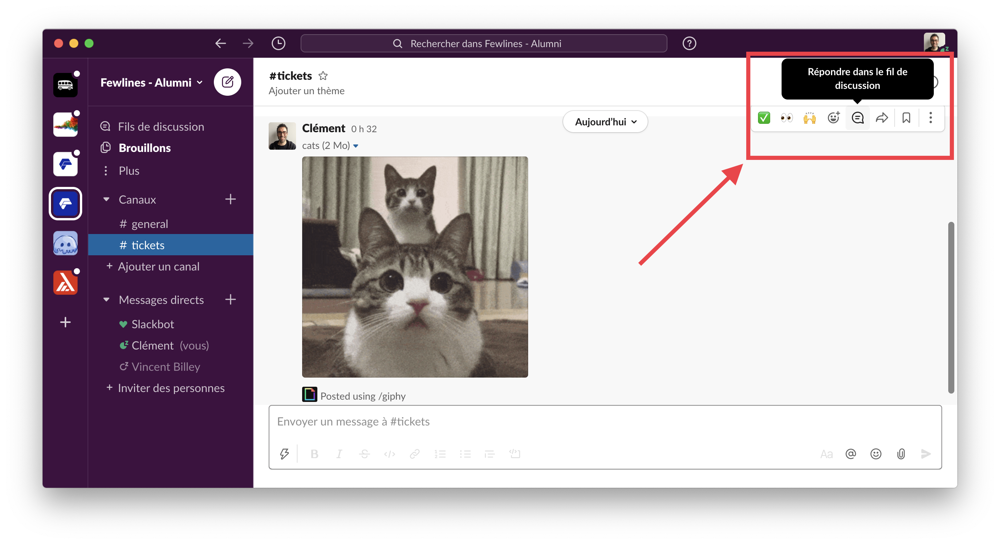

# Slack Guide

In a room full of developpers trying to work, it's best to communicate by writing.

This way, important information won't be lost and nobody will be bothered by the noise 😉

Slack will be one of your primary tools during the training. And you will soon learn to use it, copy pasting emojis everywhere, telling jokes that nobody except you will understand or sharing [giphy cats](https://giphy.com/search/cats).

But it's always better to keep things organised 😁.

## Speak english 🇬🇧

Communicate as much as possible in english on publics slack channels. Not everyone is a fluent english speaker and use the language on slack will help everyone practice.

The reason is simple: most of the coding resources you will find on the internet will be in the language of Shakespeare.

Even our courses are written in english!

## Discuss in threads

When you want to answer to a publication, please use threads, this way we won't be lost between multiple interlaced discussions:

## Use the right channel

As you can see, we have several channels and each one have a description. Please read it and post the messages at the right place 🙇.
