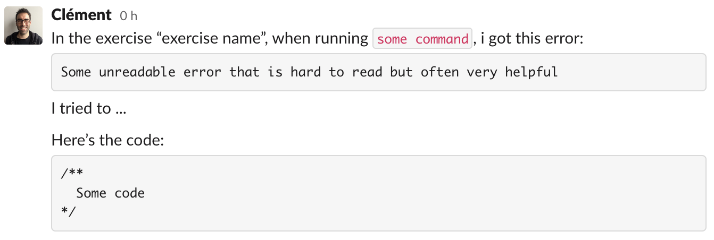

# Ask for help

When learning to code it's perfectly normal to need help sometimes. We all do.

**Never be ashamed** when you don't understand something! The best way to get an answer is to ask your question.

## Identify the problem

Coding problems can be hard to find or to fix. Asking someone to come, jump right in your code without explanation is never a good idea. In order to get the best help you can, it's important to explain **what** happens, and **when**.

As you will learn during the training, be able to explain your problem is often make half the work. Here are some questions you should answer before asking:
- Do I have an error ? if yes, what is it telling me ?
- Which part of my code is buggy? Try to isolate it.
- Which answers can I found in my favorite search engine?

Answer to those questions will sometimes help you understand where the bug is so you can fix it all by yourself.

Ooooooor, [you can try to talk to the 🦆](https://en.wikipedia.org/wiki/Rubber_duck_debugging#:~:text=In%20software%20engineering%2C%20rubber%20duck,%2Dline%2C%20to%20the%20duck.). It works surprinsigly well!

In other cases, don't hesitate: ask! 😉

## How to ask?

🚫 Here's a bad example of help request:

> My code doesn't work. It just tells me `an error occured...`

✅ And here is the good way:

> In the exercise "exercise name", when running `some command`, i got this error:
>  ```
>  Some unreadable error that is hard to read but often very helpful
>  ```
> I tried to ...
> Here's the code:
>
> ```js
> /**
>   Some code
> */
> ```

Yes. Asking for help takes time. But, once again, trying to describe your problem the best way you can **will help you a lot**.

## Where to ask

Any help request to the teachers during a training day must be written on Slack under the **Tickets** channel as described above:



An available teacher will then come to **support** you in your bug hunt 🐛🔫. We won't do it for you, we will help you to fix it by yourself 😉.

When the ticket is over, the teacher will mark the post with ✅.

## Help is the best way to learn

Understanding things is already a big deal. But trying to explain what you understood to others is the best way to deeply learn something.

**Never hesitate to help your teammates, we consider it as part of the trip.**
